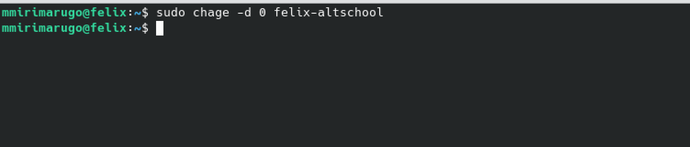

# altschool-assignment
This is my first assignment in the Cloud Engineering Bootcamp at Altschool. Below is a step-by-step breakdown of the assingment task with attached picture illustrations of the commands on my Linux VM.

First, let us create a user called "felix-altschool" with an expiration date of two weeks!


Let us confirm that the user has been created by running the following command 

```
$ cat /etc/passwd | grep felix-altschool
```


Now, let us prompt the user to provide password on sign in.



A quick rundown of everything we have done so far.
- We have created a user ('felix-altschool') which has an expiration of two weeks.
- We have also added a prompt for password to this user.

Now, let us confirm that all these features were applied correctly to this user.


As shown in the image above, the Account expires on 1st September, 2023 which is exactly two weeks from the day it was created.

The next step in the process, we are going to create a group called 'altschool' and then add the user to this group.
- As shown in the image below, in the first line, we created the group 'altschool'. 
- In the second command, we added the user 'felix-altschool' to the group 'altschool'.
- This was confirmed in the third command which listed what groups felix-altschool belonged. 


The next step in our task is to restrict the group 'altschool' to be able to only run `cat` command on /etc/. 
We will achieve this by editing the 'sudoers' file by running the following command 
```
$ sudo visudo
``` 
This will open the sudoers file in vim and allow us to make the necessary changes as shown in the image below.


Finally, the last task in this series requires us to create a new user and ensure that this user does not have a /home/ directory. 

First let us create the user 'felix_cloud_engineer' and confirm that it has the /home/ directory before removing same. 


In the first command above, we created a new user and in the second command, we checked to confirm that the user has a /home/ directory. 

Now let us go ahead and remove the home directory for the user 'felix_cloud_engineer' by running the following command,

```
sudo usermod -d "" felix_cloud_engineer
```


As seen above, after running the first command and checking the user, 'felix_cloud_engineer' again, the /home/ directory is no longer available. 